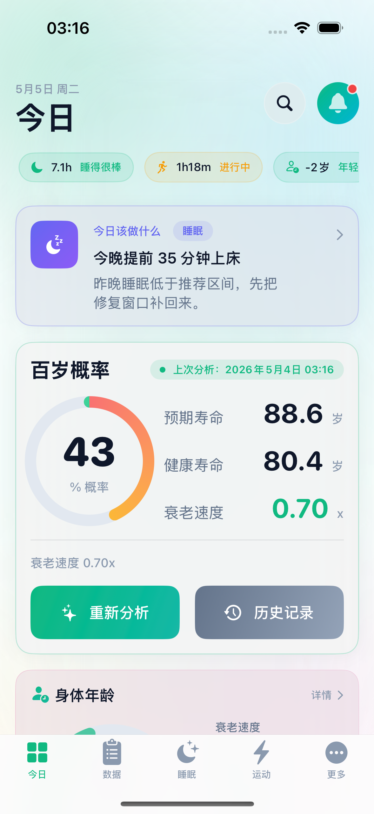
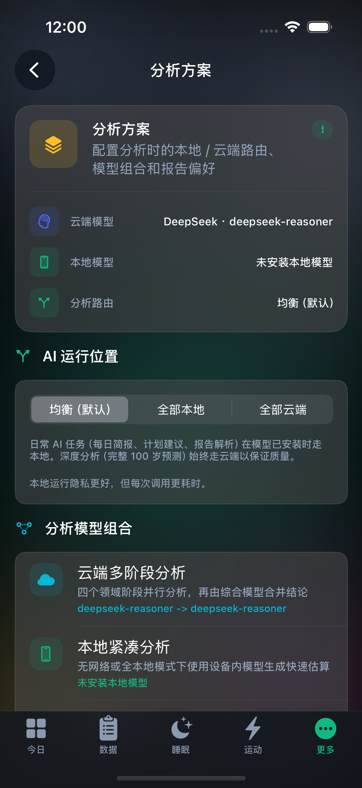
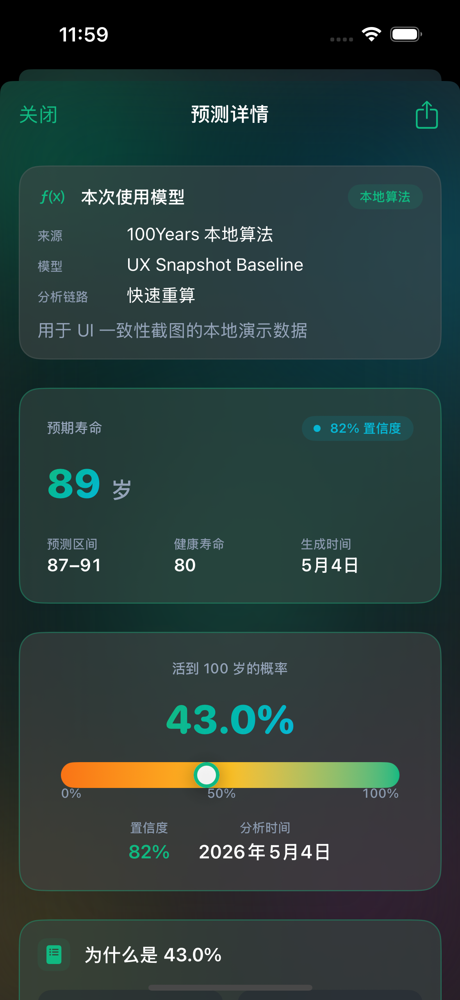

# 100 Years - Gemma 4 Edge AI Demo

Public landing page for the 100 Years Gemma 4 Hackathon submission.

## Submission Links

| Item | URL / Status |
| --- | --- |
| Online demo URL | `https://github.com/Gracker/100years-gemma4-edge-demo` |
| Demo video URL | Pending upload |
| Technical report | [English](technical-report.md) / [Chinese](technical-report.zh.md) |
| Source repository | [Gracker/100Years](https://github.com/Gracker/100Years), private repo with GDG Reviewer access granted |
| Track | C - Edge AI |

This public repository is intentionally small. It contains only the landing page, public screenshots, public technical-report copies, and submission notes. It does not contain private iOS source code, model files, API keys, health data, or user data.

## Why This Is The Online Demo URL

100 Years is an Edge AI iOS app. The real demo runs on a physical iPhone with a local Gemma 4 E2B/E4B runtime, so there is no hosted web inference server to try in a browser. This page is the public online entry point for judges: it links the video, report, private source repo, feature matrix, and demo flow.

The main source repo remains private because it contains unreleased iOS code and health-data related implementation details. GitHub does not provide a reliable "make one file public" mode for a private repository, so this separate public repo is the submission-safe landing page.

## Product Positioning

100 Years is a privacy-first iOS longevity assistant. It combines HealthKit, sleep, activity, body metrics, lifestyle answers, medical reports, personal medical conditions, chronic diseases, family history, long-term medications, and private notes into a longitudinal health profile. Gemma 4 E2B/E4B then turns that profile into explanations, risk context, and practical next actions on device whenever the selected task supports local execution.

The app does not diagnose disease or provide clinical prognosis. Its role is health education, risk awareness, and personal context preservation.

## Feature Support Matrix

| Feature | Support mode | Demo priority | What to show |
| --- | --- | --- | --- |
| Today daily health brief | Fully local | Must show | Gemma 4 agent calls read-only health tools, then returns a short health brief and metadata-only receipt. |
| Gemma 4 tool calling | Fully local | Must show | JSON tool calls such as health snapshot, sleep analysis, and lifespan impact. |
| Single-stage longevity estimate | Fully local | Must show | Medical history, HealthKit, reports, and lifestyle context entering a local prompt. |
| Private medical-history profile | Fully local | Must show | Personal conditions, chronic diseases, family history, medications, and notes stay in the local profile. |
| Local OCR/PDF + Gemma text structuring | Fully local fallback | Recommended | Local OCR/PDFKit extraction plus local Gemma text structuring. |
| Compact sleep / exercise adjustment | Edge-cloud combined | Optional | Local compact estimate first; cloud only for explicitly selected deeper analysis. |
| Full scenario and lifestyle analysis | Cloud only | Comparison only | Long-context deep reasoning is not the primary Edge AI demo. |
| Gemma native vision | Wired, validation gated | Boundary note | Do not claim production readiness until real iPhone validation is complete. |

## Model-Centered Demo Flow

1. Show local model state: open the local model or result receipt screen and show Gemma 4 E2B/E4B, execution route, and local/cloud label.
2. Show Gemma 4 tool calling: generate the Today brief and explain the path through `DailyBriefGenerator -> AgentExecutor -> GemmaAgentDriver -> HealthAgentTools`.
3. Show private medical history: add a condition, family-history item, or medication and explain how it changes local prompt context and disease-risk scoring.
4. Show structured local output: run compact longevity analysis and show parsed health scores, risk factors, recommendations, and metadata-only receipt.
5. Show local-first report parsing: import a report/PDF/screenshot and explain local OCR/PDFKit plus local Gemma text structuring.
6. Show edge-cloud boundaries: explain `balanced`, `allLocal`, and `allCloud`, then state which tasks are local, edge-cloud combined, cloud-only, or validation gated.

## Core Technical Evidence

The source repo is private. The links below require repository access; GDG Reviewer access has been granted.

| Code | Role |
| --- | --- |
| [DailyBriefGenerator.generate](https://github.com/Gracker/100Years/blob/main/100Years/Services/AIService/Agent/DailyBriefGenerator.swift#L24) | Today brief entry point: route planning, Gemma agent, or direct JSON path. |
| [AgentExecutor.run](https://github.com/Gracker/100Years/blob/main/100Years/Services/AIService/Agent/AgentExecutor.swift#L141) | Tool-calling loop with turn, tool-call, wall-clock, and repeat-call limits. |
| [GemmaAgentDriver.nextStep](https://github.com/Gracker/100Years/blob/main/100Years/Services/AIService/Agent/GemmaAgentDriver.swift#L32) | Calls the local Gemma runtime and constrains output with grammar. |
| [HealthAgentTools](https://github.com/Gracker/100Years/blob/main/100Years/Services/AIService/Agent/HealthAgentTools.swift#L18) | Registers read-only health tools. |
| [AITaskRouter.plan](https://github.com/Gracker/100Years/blob/main/100Years/Services/AIService/AITaskRouter.swift#L56) | Chooses edge or cloud from task type, model install state, network state, user mode, and native-vision capability. |
| [AIService+CompactEdge](https://github.com/Gracker/100Years/blob/main/100Years/Services/AIService/AIService+CompactEdge.swift#L446) | Builds compact local longevity prompts. |
| [LongevityAlgorithm.calculateDiseaseRiskScore](https://github.com/Gracker/100Years/blob/main/100Years/Services/LongevityAlgorithm.swift#L540) | Uses personal and family medical history in diseaseRisk. |
| [AIExecutionReceipt](https://github.com/Gracker/100Years/blob/main/100Years/Services/AIService/AIExecutionReceipt.swift#L59) | Metadata-only route and privacy receipt. |

## Privacy And Boundary Notes

- Medical history, family history, medications, and notes are sensitive personal data.
- Local-capable tasks keep this context in the device-local profile.
- Execution receipts disclose route, model, data categories, and tool IDs, not raw disease names, notes, report text, or HealthKit values.
- Outputs are health-model estimates and education, not diagnosis, treatment, or clinical prognosis.
- The stable Edge AI demo centers on local Gemma text inference, tool calling, local-first parsing, medical-history context, and metadata-only receipts.
- Native vision remains real-device validation gated.

## Screenshots

| Today brief | Local model settings | Prediction detail |
| --- | --- | --- |
|  |  |  |

